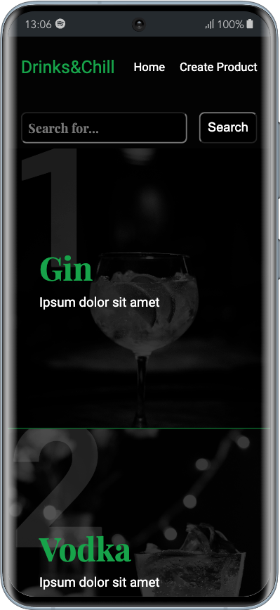
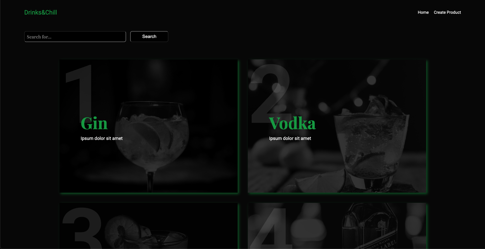
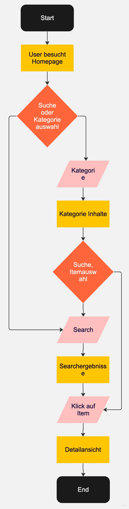

# Project Cocktail API

This was a group project intended to learn and repeat the usage of APIs in REACT with different hooks. The Webpage allows the search for specific Cocktail drinks or click through various categories to look for Cocktail drinks.

## Newly learned methods

- useNavigate
- local storage

## Tools

## Screenshots

## Demo

## Flowchart / Programmablaufsplan

## Authors

[Wilhelm Lenz](https://github.com/wilhelm-lenz)
[K. Wiefel ](https://github.com/KWiefel)
[Suat Ucar](https://github.com/SuperCoderSuat)
[Metin Karakaya](https://github.com/KarakayaMetin8787)
